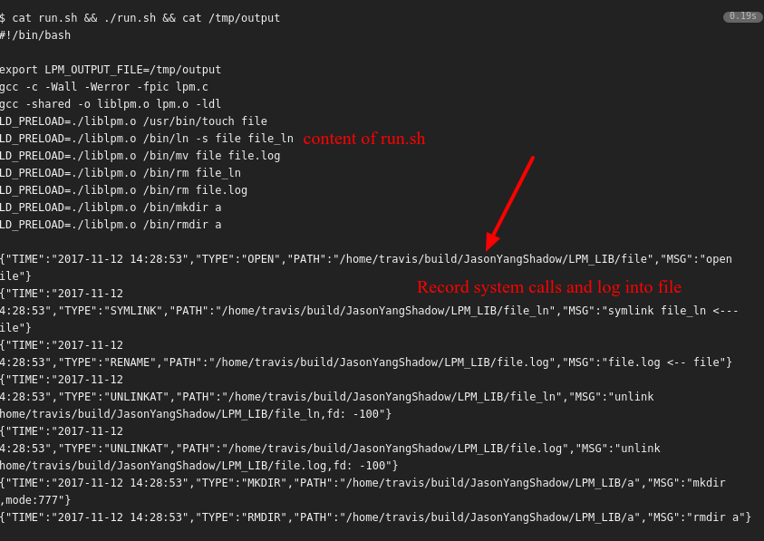

# A System Calls Record Tool 

This is a library written in pure C.

Use it to monitor system calls on Linux system and log the info to disk file. It is similar to strace except it can be compiled to library and use LD_PRELOAD trick to inject into binary program running stage.

This tool belongs to the project [LPM](https://lpm.bio), which is a package management tools and allows you to install packages without root access.

Please enjoy!

